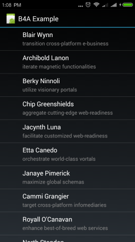
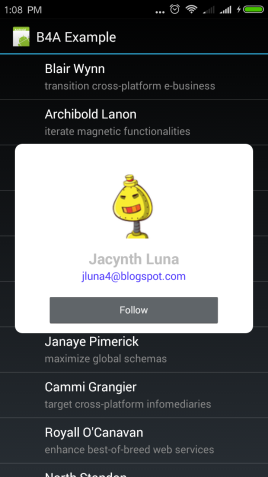

# B4A-JSPopupWindow
PopupWindow Wrapper for B4A (Basic4Android)

==Copy .jar, .xml to your additional library folder==

The provided sample (source) requires additional library:
* JSON

You can find the additional library in [B4A Forum](https://b4x.com/android/forum/#b4a-development-tool-for-native-android-apps.25)

  

### Sample
```
Sub Globals
Dim popup As JSPopupWindow
....

'somewhere in your code to trigger popup
Dim mapper As Map = mockData.Get(Position)

'create view content
Dim viewContent As Panel
viewContent.Initialize("")
viewContent.LoadLayout("layout1")

'add background/color
Dim cd As ColorDrawable
cd.Initialize(Colors.White, 10dip)
viewContent.Background = cd

'initialize popup
popup.Initialize("popup", viewContent, 100%x - 40dip, btnFollow.Top + btnFollow.Height + 10dip)

'set content data/layout
imgAvatar.Bitmap = LoadBitmap(File.DirAssets, "adipiscisitesse.png")
imgAvatar.Left = popup.Width / 2 - imgAvatar.Width / 2

lblName.Text = mapper.Get("fullname")
lblName.Left = popup.Width / 2 - lblName.Width / 2
lblAccount.Text = mapper.Get("email")

lblAccount.Left = popup.Width / 2 - lblAccount.Width / 2
btnFollow.Left = popup.Width / 2 - btnFollow.Width / 2

' show poup
popup.showAtLocation(LV, Gravity.CENTER, 0dip, 0dip)
```
